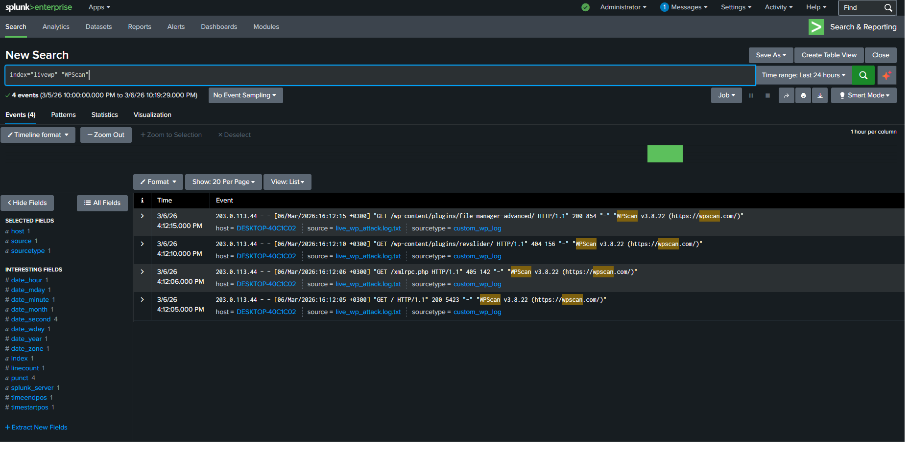
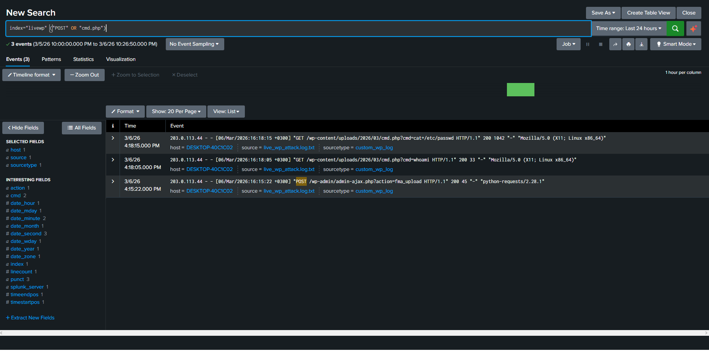

# Live System Incident Response: WordPress Cyber Kill Chain
*Turkish translation is available below / Türkçe çevirisi aşağıdadır.*

## 🇬🇧 English - Objective
The objective of this project is to perform a realistic **Incident Response (IR)** investigation on a live WordPress web server (`rehbersizwp.com`). Instead of analyzing a single isolated event, I tracked a complete **Cyber Kill Chain**—from the threat actor's initial reconnaissance using automated scanners to the final exploitation and remote code execution via a malicious webshell.

### Phase 1: Reconnaissance (WPScan)
Threat actors utilize automated tools to map the attack surface. Using Splunk SPL, I identified the attacker IP (`203.0.113.44`) actively enumerating vulnerable plugins using the `WPScan` tool, eventually discovering an exposed `file-manager-advanced` plugin.
* **SPL Query:** `index="livewp" "WPScan"`

### Phase 2: Exploitation & Webshell Execution
After identifying the vulnerability, the attacker escalated the attack by uploading a PHP webshell (`cmd.php`) via a POST request. The logs clearly demonstrate the attacker executing system-level Linux commands (`whoami` and `cat /etc/passwd`) directly from the URL parameters, confirming full system compromise.
* **SPL Query:** `index="livewp" ("POST" OR "cmd.php")`

---

## 🇹🇷 Türkçe - Amacımız
Bu projenin amacı, canlı bir WordPress web sunucusu üzerinde gerçekçi bir **Olay Müdahalesi (Incident Response)** soruşturması yürütmektir. İzole edilmiş tek bir olayı incelemek yerine; tehdit aktörünün otomatik tarayıcılar kullanarak yaptığı ilk keşif aşamasından, zararlı bir arka kapı (webshell) aracılığıyla sistemi ele geçirdiği son sömürü (exploit) aşamasına kadar tam bir **Siber Saldırı Zincirini (Cyber Kill Chain)** loglar üzerinden takip ettim.

### 1. Aşama: Keşif (WPScan)
Tehdit aktörleri saldırı yüzeyini haritalamak için otomatik araçlar kullanır. Splunk SPL komutlarını kullanarak, saldırganın (`203.0.113.44`) `WPScan` aracını kullanarak zayıf eklentileri (plugin) tek tek denediği ve nihayetinde savunmasız `file-manager-advanced` eklentisini bulduğu keşif anını tespit ettim.
* **SPL Sorgusu:** `index="livewp" "WPScan"`

### 2. Aşama: Sömürü (Exploitation) ve Arka Kapı (Webshell)
Saldırgan, zayıflığı tespit ettikten sonra bir POST isteği ile sisteme PHP tabanlı bir arka kapı (`cmd.php`) yükleyerek saldırıyı bir üst boyuta taşıdı. Loglar, saldırganın doğrudan URL parametreleri üzerinden sistem seviyesinde Linux komutları (`whoami` ve `cat /etc/passwd`) çalıştırdığını ve sistemin tamamen ele geçirildiğini (Compromise) net bir şekilde kanıtlamaktadır.
* **SPL Sorgusu:** `index="livewp" ("POST" OR "cmd.php")`

## Conclusion / Sonuç
This lab highlights the crucial difference between simple log aggregation and true Incident Response. By correlating sequence of events, I was able to reconstruct the attacker's exact methodology and identify the root cause of the breach. / *Bu laboratuvar, basit log toplama işlemi ile gerçek Olay Müdahalesi arasındaki kritik farkı vurgulamaktadır. Olayların sırasını ilişkilendirerek, saldırganın tam metodolojisini yeniden inşa ettim ve ihlalin kök nedenini başarıyla tespit ettim.*
